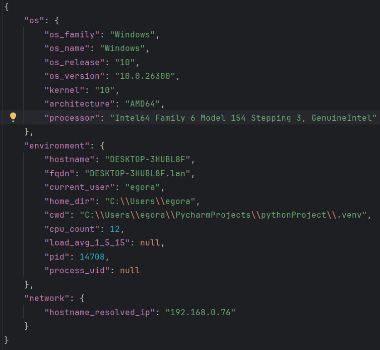

# Кроссплатформенный сбор информации об ОС

Программа собирает информацию об операционной системе и сохраняет её в файл `os_report.json`. 
### Функциональный подход был выбран для простоты и дальнейшего расширения проекта.

## Описание работы

1. Программа определяет ОС с помощью `platform.system()` в функции `detect_os()`.
2. Функция `collect_os_info()` собирает общую информацию: семейство ОС, название, версию, релиз, ядро, архитектуру и модель процессора.
3. Дополнительно собирается информация об окружении: имя хоста, FQDN, текущий пользователь, домашняя директория, текущая рабочая директория, количество ядер, средняя загрузка, PID процесса и UID.
4. Отдельно собирается сетевая информация: IP-адрес, полученный при разрешении имени хоста.
5. Функция `_safe_getuid()` безопасно получает UID пользователя (только для Unix-подобных систем).
6. Функция `_resolve_hostname()` пытается разрешить имя хоста в IP-адрес.
7. Функция `save_report()` сохраняет полученный словарь в файл `os_report.json` в формате JSON.
8. GitHub Actions запускает программу на Linux, Windows и macOS, чтобы проверить её работу на разных операционных системах.

## Собираемая информация

- семейство операционной системы (`os_family`);
- название операционной системы (`os_name`);
- версию (`os_version`) и релиз (`os_release`);
- версию ядра (`kernel`);
- архитектуру процессора (`architecture`);
- модель процессора (`processor`);
- имя компьютера (`hostname`);
- полное доменное имя (`fqdn`);
- имя текущего пользователя (`current_user`);
- домашнюю директорию (`home_dir`);
- текущую рабочую директорию (`cwd`);
- количество ядер процессора (`cpu_count`);
- среднюю загрузку системы за 1, 5 и 15 минут (`load_avg_1_5_15`);
- идентификатор процесса (`pid`);
- UID процесса (`process_uid`);
- IP-адрес, полученный при разрешении имени хоста (`hostname_resolved_ip`).

## GitHub Actions

Workflow автоматически запускает программу на трёх операционных системах:

- Ubuntu;
- Windows;
- macOS.

## Результаты выполнения

### Linux

### macOS

### Windows

